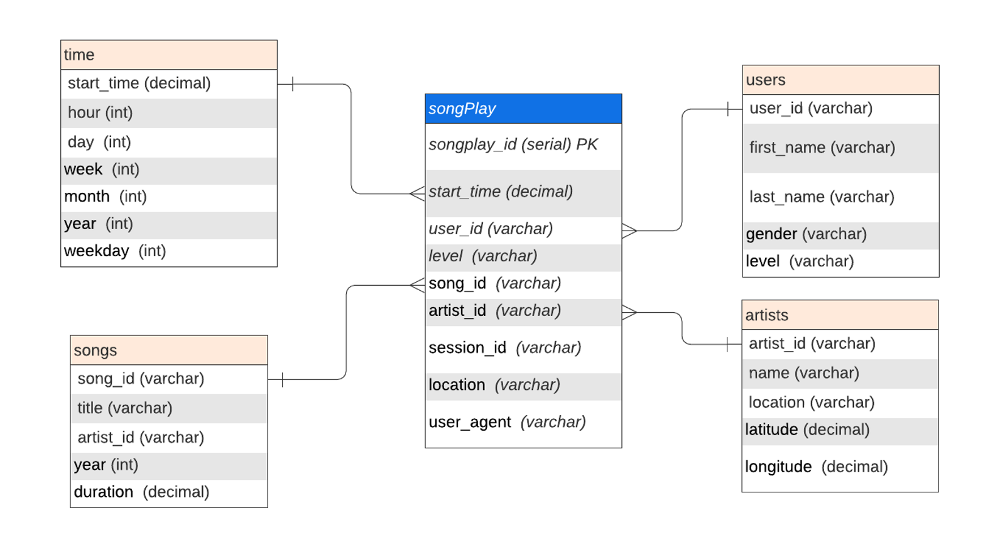
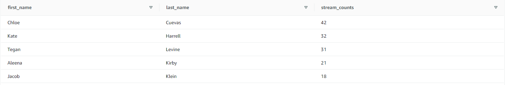
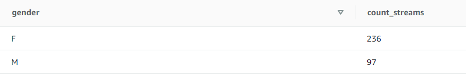
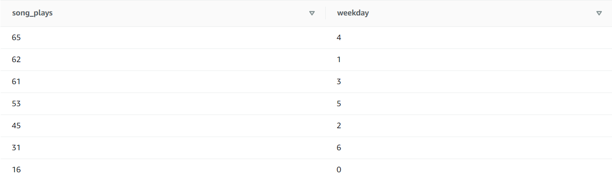

# Sparkify Data Warehouse

## Purpose
The purpose of this database is to move Sparkify's analytics processes and data onto the cloud. Currently, the data resides in S3, in a directory of JSON logs on user activity on the app, as well as a directory with JSON metadata on the songs in their app. This database, developed using AWS Redshift, clones the s3 data into a staging environment, before normalizing the data into a series of fact and dimension tables as defined below:

## Schema and ETL Pipeline
Schema for the database is depicted below:

This design allows for faster reads on user session data, while also attempting to minimize data redundancy within the datawarehouse. To create and populate the tables, the following python scripts were used:

- **sql_queries.py**: Defines the table schemas, and defines queries to create and insert data to the each table, including staging, fact, and dimension tables for the database
- **create_tables.py**: When executed, drops and creates the tables by invoking the create_table_queries in the SQL_queries files drop_table_queries
- **etl.py**: Copies log and song files to staging, by invoking load_staging_tables. It then inserts parsed data to the correct fact and dim table using insert_tables queries in sql_queries.py
- **dwh.cfg**: Config file that contains connection parameters to the sparkify datawarehouse, as well as paths to the s3 log and json files 

To create the and populate the databases, follow the following steps:
1. Create AWS Redshift cluster and IAM role
2. Populate the dwh.cfg file with the correct database credentials and IAM ARN
3. Execute the create_tables.py file. 
4. Once the tables have been created, execute the etl.py file.

## Example Queries

The following query prints the first and last names of the top 5 users who have streamed the most songs

**Query:**
<pre><code>
SELECT u.first_name, u.last_name, c.stream_counts 
    FROM (SELECT count(songplay_id) as stream_counts, user_id FROM songplays GROUP BY user_id) as c 
    JOIN users as u ON u.user_id = c.user_id 
ORDER BY stream_counts DESC LIMIT 5
</code></pre>

**Output:**

==============================================================================================================================

The following query returns a breakdown of streams by gender

**Query:**
<pre><code>
SELECT u.gender, count(s.songplay_id) as count_streams 
FROM songplays as s 
    JOIN users as u ON s.user_id = u.user_id
GROUP BY u.gender
</code></pre>

**Output:**

==============================================================================================================================

The following query returns a breakdown of streams by day of week

**Query:**
<pre><code>
SELECT count(*) as song_plays, t.weekday as weekday
FROM songplays as s
JOIN time as t
    ON s.start_time = t.ts
GROUP BY t.weekday
ORDER BY song_plays DESC
</code></pre>

**Output:**

